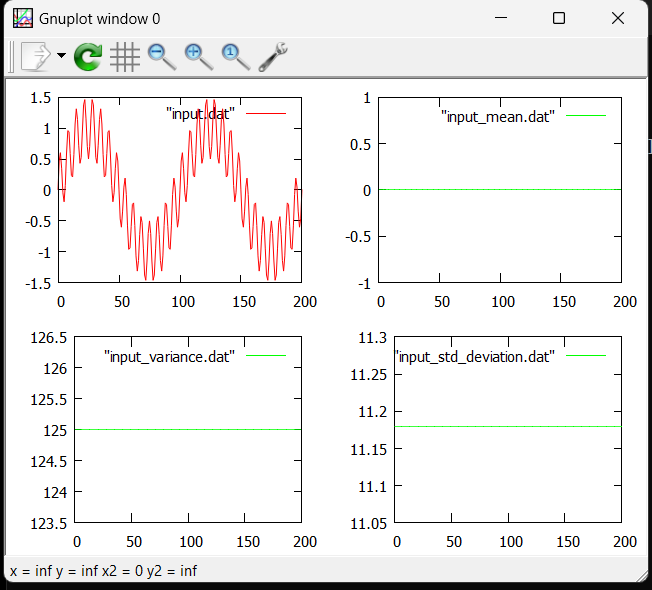
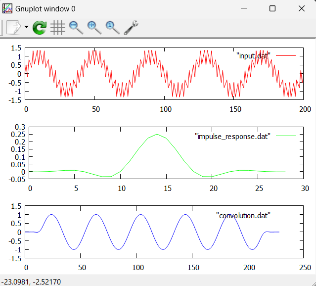
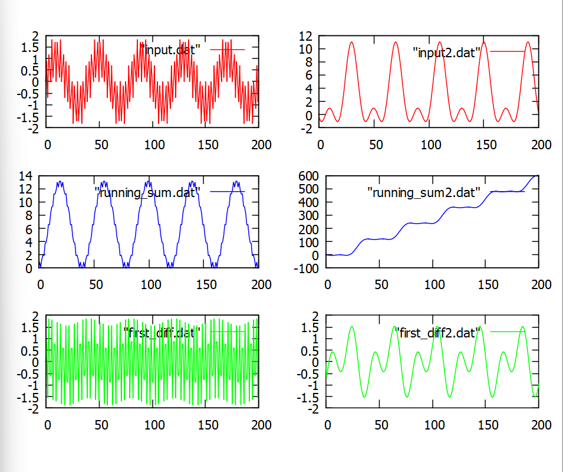
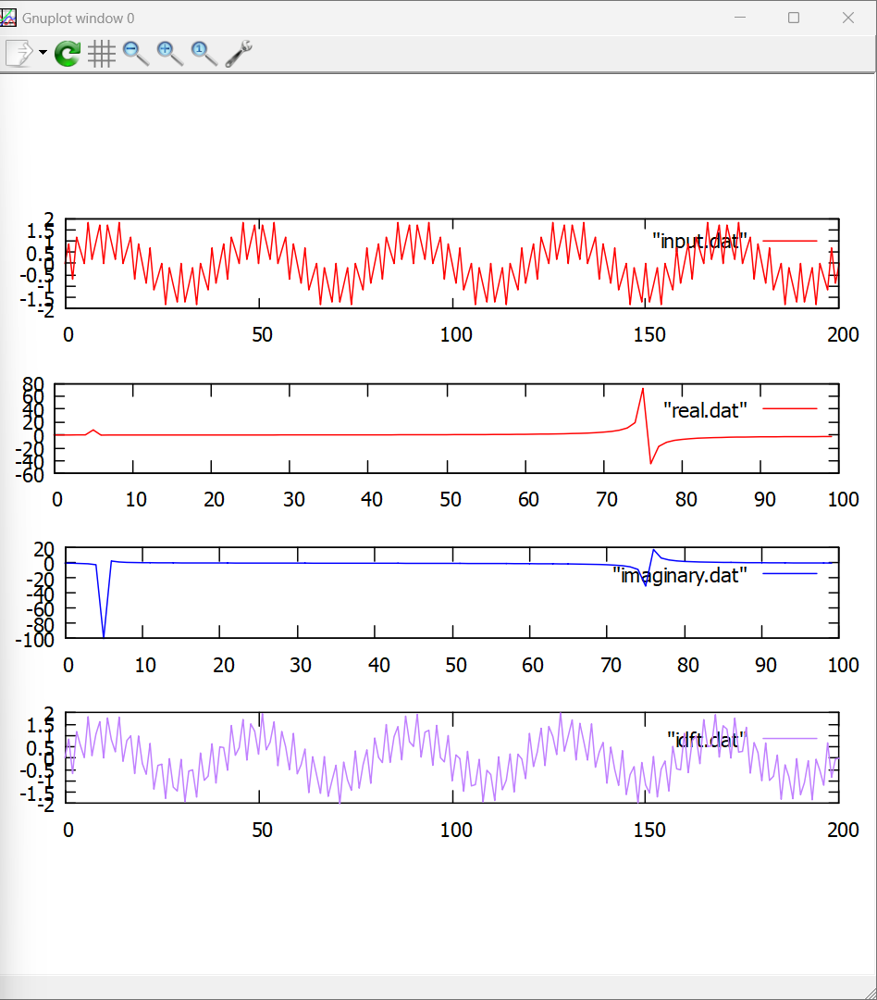

# My DSP

### A set of mathematical functions useful for Digital Signal Processing.

## Headers

- stdlib.h
- stdbool.h
- math.h

## Array functions (signal functions)

- signal_generate
- signal_mean
- signal_variance
- signal_standard_deviation
- signal_convolution
- signal_first_difference
- signal_running_sum
- signal_DFT
- signal_complex_DFT
- signal_inverse_DFT
- signal_amplitude
- signal_phase

## Single point functions

- point_ret_to_polar

## Array functions description

- #### signal_mean

```C
double signal_mean(double* signal_source, unsigned int signal_length);
```
##### Returns the mean value of signal according to the function:

#### $$\mu \=\\frac{1}{N}\sum _{i=0}^{N-1}\left(x_i\right)$$

- #### signal_variance

```C
double signal_variance(double* signal_source, double signal_mean, unsigned int signal_length);
```

##### Returns the variance value of signal according to the function:

#### $$\sigma^2 \=\\sum _{i=0}^{N-1}\left(x_i-\mu \right)^2$$

- #### signal_standard_deviation

```C
double signal_standard_deviation(double signal_variance);
```

##### Returns the standard deviation value of signal according to the function:

#### $$\sigma \=\\sqrt{\sigma ^2}$$

- #### signal_convolution

```C
double* signal_convolution(double* signal_source, unsigned int signal_length, double* impulse_response, unsigned int impulse_response_length);
```

##### Returns an array of signal according to the function:

#### $$\left(f\cdot h_N\right)\left[n\right]\=\\sum _{j=0}^{N-1}f\left[j\right]h_N\left[n-j\right]$$

- #### signal_first_difference

```C
double* signal_first_difference(double* signal_source, unsigned int signal_length);
```

##### Simple form for the numerical first derivative according to the function:

#### $$D\left[n\right]\=\frac{X\left[n\right]-X\left[n-1\right]}{N}$$

- #### signal_running_sum

```C
double* signal_running_sum(double* signal_source, unsigned int signal_length);
```

##### Simple form for the numerical integration according to the function:

#### $$D\left[n\right]\=X\left[n\right]-D\left[n-1\right]$$

- #### signal_DFT

```C
double* signal_DFT(double* signal_source, unsigned int signal_length, bool mode);
```

#### For _mode_ = 1, the function returns the real part array of the decomposed signal according to the function:

#### $$X_j\=\\sum _{i=0}^{N-1}x_i\cdot cos\left(\frac{2\pi ij}{N}\right)$$

#### For _mode_ = 0, the function returns the imaginary part array of the decomposed signal according to the function:

#### $$X_j\=\\sum _{i=0}^{N-1}x_i\cdot -sin\left(\frac{2\pi ij}{N}\right)$$

- #### signal_complex_DFT

```C
double* signal_complex_DFT(double* real_signal_source, double* imaginary_signal_source, unsigned int signal_length, bool mode);
```
 - ##### _R_ being the real signal input and _I_ the imaginary signal input.
  
#### For _mode_ = 1, the function returns the real part array of the decomposed signal according to the function:

#### $$X_j\=\\sum \_{i=0}^{N-1}R_i\cdot \cos\left(\frac{2\pi ij}{N}\right)+I_i\.\sin\left(\frac{2\pi ij}{N}\right)$$

#### For _mode_ = 0, the function returns the imaginary part array of the decomposed signal according to the function:

#### $$X_j\=\\sum \_{i=0}^{N-1}-I_i\cdot \left(\cos\left(\frac{2\pi ij}{N}\right)+\sin\left(\frac{2\pi ij}{N}\right)\right)$$

- #### signal_inverse_DFT

```C
double* signal_inverse_DFT(double* real_signal_source, double* imaginary_signal_source, unsigned int signal_source_length);
```

##### Returns an array of signal with the signal in time domain from frequence domain real and imaginary arrays:

- #### signal_amplitude

```C
double* signal_amplitude(double* real_signal_source, double* imaginary_signal_source, unsigned int signal_source_length);
```

##### Returns an array of signal amplitude for each point from real and imaginary arrays of decomposed signal according to the function:

#### $$\left|X_k\right|=\sqrt{\Re\left(x_k\right)^2+\Im\left(x_k\right)^2\}$$

- #### signal_phase

```C
double* signal_phase(double* real_signal_source, double* imaginary_signal_source, unsigned int signal_source_length);
```

##### Returns an array of signal phase for each point from real and imaginary arrays of decomposed signal according to the function:

#### $$Arg\left(X_k\right)\=\\arctan \left(\Im\left(x_k\right),\Re\left(x_k\right)\right)$$

## Single point functions description

- #### point_ret_to_polar

```
double point_ret_to_polar(double point_x, double point_y, bool axis)
```

##### Converts a (x,y) point to (r,θ) point.

### Examples

- Mean, Variance and Standard Deviation



- Convolution



- First Difference and Running Sum



- DFT and Inverse DFT


